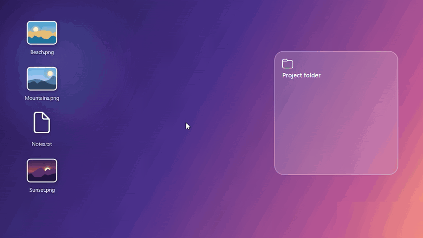
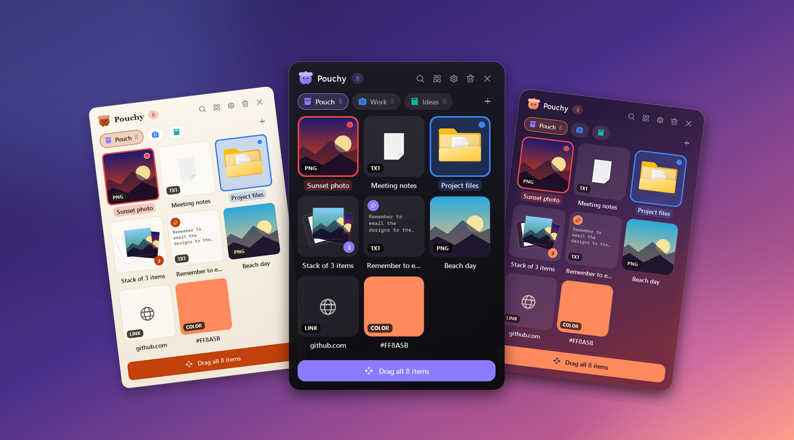
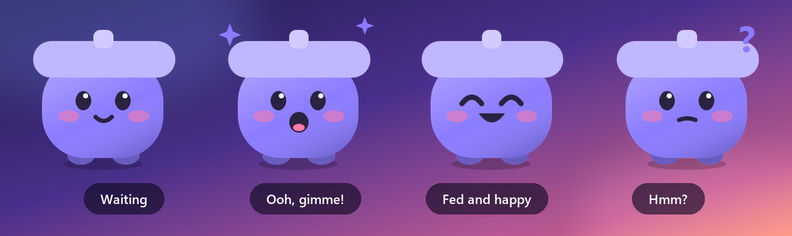
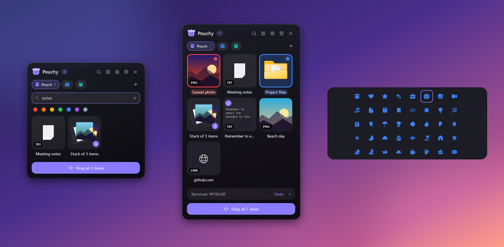
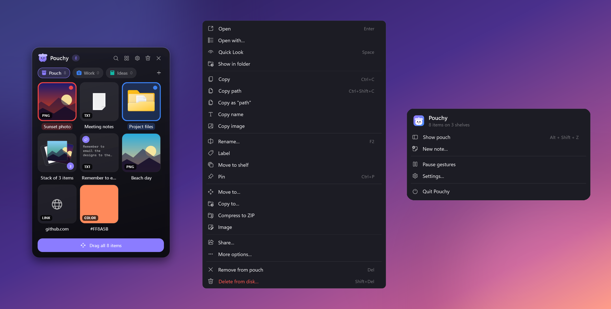
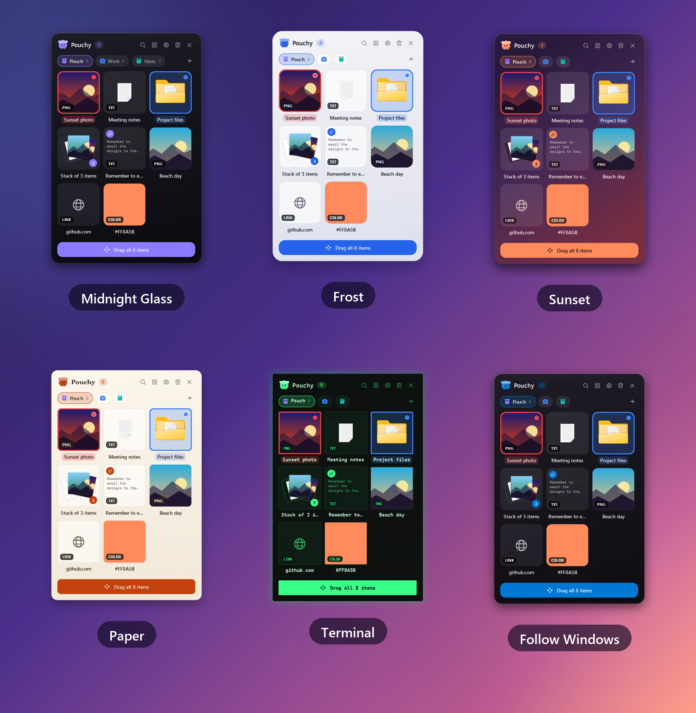
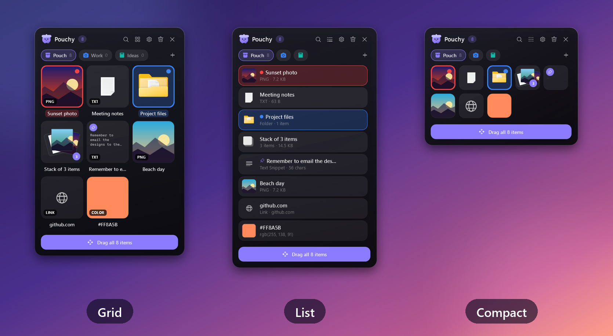

<div align="center">


# Pouchy

### Shake your mouse. Park anything. Drop it anywhere.

**The cute drop shelf for Windows.** A temporary home for files, images, links and text while you move between apps.
<br />
A native **Dropover / Yoink alternative for Windows 10 & 11**.

<a href="https://github.com/editorrylix/Pouchy/releases/latest"></a>
<a href="https://github.com/editorrylix/Pouchy/releases"></a>
<a href="https://github.com/editorrylix/Pouchy/actions/workflows/ci.yml"></a>


<a href="#license"></a>

<br />
<br />

<a href="https://github.com/editorrylix/Pouchy/releases/latest">
  
</a>

<sub>Single .exe · no installer · no .NET needed · x64 &amp; ARM64</sub>

<br />
<br />



<sub>▶ <a href="docs/media/demo.mp4">Watch the full one-minute demo</a> with right-click actions, search, shelves and themes</sub>

</div>

---

## Why Pouchy?

Dragging a file between two apps on Windows usually turns into a juggling act: Alt-Tab, lose the window you wanted, give up and dump the file on the desktop.

Pouchy gives your stuff somewhere to wait.

<table>
  <tr>
    <td width="33%" valign="top">
      <h3>🫳 Shake to summon</h3>
      Grab any file and give the mouse a little shake. Pouchy pops up right where you are. You can also bump the screen edge or press <kbd>Alt</kbd>+<kbd>Shift</kbd>+<kbd>Z</kbd>.
    </td>
    <td width="33%" valign="top">
      <h3>📥 Park anything</h3>
      Files, folders, multi-file stacks, images, text snippets, links and colour codes. Everything stays put until you need it, even after a restart.
    </td>
    <td width="33%" valign="top">
      <h3>🚀 Drop it anywhere</h3>
      Drag items out to Explorer, Discord, Photoshop, your browser or any other app. Files are <b>copied</b> by default, so nothing goes missing from where it came from.
    </td>
  </tr>
</table>

<p align="center">
  
</p>

---

## Meet Pouchy 👋

Pouchy has a little friend. It waits patiently, gets excited when you drag something over, hops happily when you feed it, and looks puzzled when a search comes up empty. (It's shy, so you can switch it off in Settings.)

<p align="center">
  
</p>

---

## Features

### 🗂️ Shelves, search, labels and undo

- **Shelves** for Work, Screenshots, Reading list or anything else, each with its own colour and one of 40 icons. Drag an item onto a tab to move it there.
- **Search every shelf** with <kbd>Ctrl</kbd>+<kbd>F</kbd>, and filter by colour label.
- **Colour labels** tint the tile, so a red item is easy to spot.
- **Pin** items so Clear keeps them.
- **Undo** removals with <kbd>Ctrl</kbd>+<kbd>Z</kbd>.

<p align="center">
  
</p>

### 🖱️ A right-click menu that does real work

| Item | What you can do |
| --- | --- |
| **Files and folders** | Open, Open with, Quick Look, Show in folder, Rename, Move or Copy to, Compress to ZIP, Extract, Delete to the Recycle Bin |
| **Images** | Convert to PNG or JPG, resize to 50% or 25%, **copy the text in the picture** (OCR, on your PC), set as wallpaper |
| **Links** | Shows the page title and icon. Open, or copy as a Markdown link |
| **Colours** | Paste `#FF8800` or `rgb(…)` and copy it back as HEX, RGB or HSL |
| **Text** | Edit, change case, tidy whitespace, save as a .txt file |
| **Everything** | Share through the Windows share sheet, or open the **full Explorer menu** (7-Zip, Send to and the rest) |

<p align="center">
  
</p>

### 🎨 Make it yours

Six built-in themes: **Midnight Glass, Frost, Sunset, Paper, Terminal** (scanlines included) and **Follow Windows**. Pick **Grid, List or Compact** view, and set the tile size, columns, opacity and open animation.

<p align="center">
  
</p>

Want your own look? Themes are small JSON files that update live while you edit them:

```json
{
  "Name": "Hot Pink",
  "Colors": { "Accent": "#FF2D95", "Background": "linear(135deg, #2A1B3D 0%, #7A3042 100%)" }
}
```

Save it in `%AppData%\Pouchy\themes\` and pick it in Settings. The [theme guide](docs/THEMES.md) lists every option.

<p align="center">
  
</p>

### ⌨️ Keyboard friendly

<details>
<summary><b>All keyboard shortcuts</b></summary>

| Shortcut | Action |
| --- | --- |
| <kbd>Alt</kbd>+<kbd>Shift</kbd>+<kbd>Z</kbd> | Show or hide Pouchy (you can change it) |
| <kbd>Space</kbd> | Quick Look |
| <kbd>Enter</kbd> | Open |
| <kbd>F2</kbd> | Rename or edit |
| <kbd>Ctrl</kbd>+<kbd>C</kbd> / <kbd>Ctrl</kbd>+<kbd>Shift</kbd>+<kbd>C</kbd> | Copy / copy file paths |
| <kbd>Ctrl</kbd>+<kbd>V</kbd> | Paste into Pouchy |
| <kbd>Ctrl</kbd>+<kbd>N</kbd> | New note |
| <kbd>Ctrl</kbd>+<kbd>F</kbd> | Search every shelf |
| <kbd>Ctrl</kbd>+<kbd>T</kbd> | New shelf |
| <kbd>Ctrl</kbd>+<kbd>Tab</kbd> / <kbd>Ctrl</kbd>+<kbd>1</kbd>–<kbd>9</kbd> | Switch shelves |
| <kbd>Ctrl</kbd>+<kbd>G</kbd> | Group selected files into a stack |
| <kbd>Ctrl</kbd>+<kbd>P</kbd> | Pin or unpin |
| <kbd>Ctrl</kbd>+<kbd>A</kbd> | Select all |
| <kbd>Ctrl</kbd>+<kbd>Z</kbd> | Undo remove |
| <kbd>Del</kbd> / <kbd>Shift</kbd>+<kbd>Del</kbd> | Remove from Pouchy / delete the file to the Recycle Bin |
| <kbd>Esc</kbd> | Clear selection, then hide |

</details>

### 🪟 Native Windows, not a web page in a box

Pouchy is a small native C#/WPF app, with no Electron and no bundled browser.

- Drags use Windows' own drag-and-drop, with the same file data and drag image Explorer uses.
- Thumbnails come straight from Windows, so photos, videos, PDFs and Office files all preview.
- High-DPI and mixed-DPI monitors are handled properly.
- Fullscreen games and apps you choose to ignore never trigger it.

---

## Get started

1. **[Download Pouchy](https://github.com/editorrylix/Pouchy/releases/latest).** Get `win-x64` for most PCs, or `win-arm64` for Snapdragon and other ARM laptops.
2. **Run `Pouchy.exe`.** There's no installer. Pouchy appears in the system tray.
3. **Drag a file and shake the mouse.** That's it! Turn on **Settings → Run at Windows startup** to always have it around.

> [!NOTE]
> **"Windows protected your PC"?** Pouchy isn't code-signed yet, so SmartScreen is cautious about new downloads. Click **More info → Run anyway**. Every release lists SHA-256 checksums so you can check your download.

**Requirements:** Windows 10 (version 2004 or later) or Windows 11.

---

## Looking for Dropover or Yoink on Windows?

If you searched for **Dropover for Windows**, **Yoink for Windows**, a **drag-and-drop shelf**, or a **temporary file holder for Windows**, this is it. Pouchy isn't a pixel-perfect copy of a Mac app. It takes the same idea and builds it for Windows, with multiple shelves, search, labels, quick actions, themes and a mascot.

---

## Privacy

Pouchy runs on your PC and keeps your things there.

- **No accounts, no analytics, no telemetry, no cloud.**
- Your shelves are saved in `%AppData%\Pouchy`.
- Only two optional features go online, and both can be turned off in Settings:
  - **Link previews:** when you drop a URL, Pouchy loads that page once to show its title and icon.
  - **Update check:** about once a day, Pouchy asks GitHub whether a newer version exists.

---

## FAQ

<details>
<summary><b>Is Pouchy free?</b></summary>

Yes, for personal and other noncommercial use. See the [license](#license).
</details>

<details>
<summary><b>Will the mouse shake trigger by accident?</b></summary>

It only reacts while you're actually dragging something. Moving windows, opening menus and selecting text are ignored. You can change the sensitivity, switch individual gestures off, choose apps to ignore, or **Pause gestures** from the tray.
</details>

<details>
<summary><b>Does it slow down my PC?</b></summary>

No. Pouchy sits idle in the tray. It only looks at mouse movement while a mouse button is held down, and it does nothing while you're in a fullscreen game.
</details>

<details>
<summary><b>Where are my files stored?</b></summary>

Nowhere new. Pouchy keeps a reference to your files, not a copy. Images pasted from the clipboard and link icons are cached in `%AppData%\Pouchy`.
</details>

---

## Build from source

You'll need Windows 10 (2004) or later and the [.NET 8 SDK](https://dotnet.microsoft.com/download/dotnet/8.0).

```powershell
git clone https://github.com/editorrylix/Pouchy.git
cd Pouchy
dotnet run --project Pouchy.csproj   # run it
dotnet test                          # 135+ tests
```

Releases are built by [GitHub Actions](.github/workflows/release.yml) whenever a version tag (`vX.Y.Z`) is pushed. See the [changelog](CHANGELOG.md) for what's new and the [roadmap](IDEAS.md) for what's next.

---

## Contributing and feedback

Found a bug or have an idea? [Open an issue](https://github.com/editorrylix/Pouchy/issues/new/choose). Screenshots and the end of `%AppData%\Pouchy\debug.log` help a lot.

If Pouchy saves you a few Alt-Tabs a day, a ⭐ helps other Windows users find it.

## Support development

Pouchy is an independent project. If it makes your day a little smoother, you can keep it going:

<a href="https://buymeacoffee.com/notrishi">
  
</a>

<a id="license"></a>

## License

Pouchy is released under the [PolyForm Noncommercial License 1.0.0](LICENSE).

You may use, copy, study, modify, fork and share Pouchy for **noncommercial** purposes. Commercial use, monetised redistribution, rebranding, bundling, or distribution through commercial app stores needs a separate commercial license from the author.

> Pouchy is **source-available**. PolyForm Noncommercial is not an OSI-approved open-source license.

<div align="center">
<br />

<br />
<sub>Made with 💜 for everyone who has ever lost a file somewhere between two windows.</sub>
</div>
