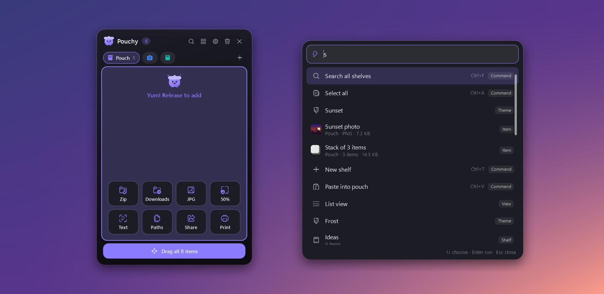

# The Pouchy guide

Everything Pouchy can do, explained in plain language. New here? Start with the [quick start](#quick-start), then skim the [everyday examples](#everyday-examples) for ideas. Everything else is here when you need it.

[← Back to the README](../README.md)

## Contents

- [Quick start](#quick-start)
- [Everyday examples](#everyday-examples)
- [The complete guide](#the-complete-guide)
  - [Opening the pouch](#opening-the-pouch) · [Putting things in](#putting-things-in) · [Taking things out](#taking-things-out) · [What each tile shows](#what-each-tile-shows)
  - [The right-click menu](#the-right-click-menu) · [Shelves](#shelves) · [Smart shelves](#smart-shelves) · [Search, labels and pins](#search-labels-and-pins)
  - [Removing, undo and auto-clear](#removing-undo-and-auto-clear) · [Drop actions](#drop-actions) · [Your own scripts](#your-own-scripts) · [Command palette](#command-palette)
  - [Clipboard history](#clipboard-history) · [Screenshots](#screenshots) · [Pouchy and File Explorer](#pouchy-and-file-explorer)
  - [Moving and docking the pouch](#moving-and-docking-the-pouch) · [The tray icon](#the-tray-icon) · [Make it yours](#make-it-yours) · [All settings](#all-settings)
- [Keyboard shortcuts](#keyboard-shortcuts)
- [Install, update and uninstall](#install-update-and-uninstall)
- [FAQ and troubleshooting](#faq-and-troubleshooting)
- [Privacy](#privacy)

## Quick start

1. **Install it.** Download `Pouchy-x.y.z-setup-x64.exe` from the [latest release](https://github.com/editorrylix/Pouchy/releases/latest) and run it. If you have a Windows on ARM laptop, such as one with a Snapdragon chip, download `-arm64` instead.
2. **Say hello.** The first time it runs, Pouchy opens a short **welcome guide** with these same steps and a few switches you might like. Afterwards it lives in the system tray, the small icons next to the clock. If you can't see it, click the **^** arrow. It also starts by itself whenever you turn on your PC.
3. **Drop something in.** Open File Explorer and start dragging any file. While you hold the mouse button, **shake the mouse left and right a few times**. The pouch pops up next to the file; let go over it.
4. **Take it out.** Open the app you want the file in, such as an email, a chat or a folder. Press <kbd>Alt</kbd>+<kbd>Shift</kbd>+<kbd>Z</kbd> to show the pouch, then drag the file from the pouch to where you want it.

That's the basics. The pouch hides when you press <kbd>Esc</kbd> or click the ✕, and keeps everything until you remove it.

> [!TIP]
> Not a fan of shaking? You can also bump the screen edge twice while dragging, click the tray icon, or use the shortcut. See [Opening the pouch](#opening-the-pouch).

## Everyday examples

These are real ways people use a drop shelf. Each one names the features it uses so you can look them up in the guide.

**📧 Attaching files to an email or chat**
> You're writing an email and need three files from three different folders. Visit each folder and drag the file into the pouch. Then go back to your email, select all three in the pouch (<kbd>Ctrl</kbd>+<kbd>A</kbd>) and drag them into the message together. *Uses: [putting things in](#putting-things-in), [taking things out](#taking-things-out).*

**🎓 Collecting research for an essay or project**
> Make a shelf called *Essay*. As you browse, drag links, quotes and images into it. Pouchy shows each link with the page's title and icon, and you can jot ideas down as notes with <kbd>Ctrl</kbd>+<kbd>N</kbd>. Next week everything is still there, and <kbd>Ctrl</kbd>+<kbd>F</kbd> finds anything. *Uses: [shelves](#shelves), [notes](#putting-things-in), [search](#search-labels-and-pins).*

**📸 Sorting photos from a phone or camera**
> Drag a batch of photos into the pouch, then drop them on the **Copy to** tile of a folder you use often. Pouchy remembers the folders you send things to, so next time it's one drop. Need smaller copies for the web? Drop them on the **50%** or **JPG** tile instead. *Uses: [drop actions](#drop-actions), [recent folders](#pouchy-and-file-explorer).*

**🐞 Reporting a bug or explaining a problem**
> Press the screenshot shortcut (<kbd>Alt</kbd>+<kbd>Shift</kbd>+<kbd>S</kbd>), drag over the problem, and the picture lands in the pouch. Take a few more, then drag them all into your bug report or support chat at once. *Uses: [screenshots](#screenshots).*

**🔤 Copying text out of a picture**
> Someone sent a screenshot of an address, a code or an error message. Put the picture in the pouch, right-click it and choose **Extract text**. The text is copied, ready to paste, and also saved as a note. *Uses: [the right-click menu](#the-right-click-menu).*

**📋 Getting back something you copied earlier**
> You copied a link an hour ago, then copied something else on top of it. With clipboard history turned on, everything you copy also goes into a *Clipboard* shelf, so the link is still there. Drag it out or press <kbd>Ctrl</kbd>+<kbd>C</kbd> on it. *Uses: [clipboard history](#clipboard-history).*

**🎨 Designers: colours and assets**
> Paste a colour like `#FF8800` into the pouch and it becomes a swatch. Right-click it to copy it as HEX, RGB or HSL for whichever tool you're in. Keep logos and icons on an *Assets* shelf and drag them into any design. *Uses: [what each tile shows](#what-each-tile-shows).*

**💻 Developers and power users**
> Copy file paths with <kbd>Ctrl</kbd>+<kbd>Shift</kbd>+<kbd>C</kbd>, open the full Explorer menu (7-Zip, Git and the rest) from **More options**, or write a small script that uploads, converts or renames files, and drop files on it as a tile. *Uses: [your own scripts](#your-own-scripts), [command palette](#command-palette).*

**🧹 Keeping your desktop clean**
> Use the pouch as a temporary desktop. Turn on **Remove old items** in Settings and anything you haven't pinned clears itself after a day or a week. Pin the few things you always need. *Uses: [auto-clear](#removing-undo-and-auto-clear), [pins](#search-labels-and-pins).*

## The complete guide

### Opening the pouch

There are several ways to open it. Use whichever feels natural:

| How | When it works |
| --- | --- |
| **Shake the mouse** left and right a few times | While you're dragging something |
| **Bump the left or right screen edge** twice | While you're dragging something |
| **<kbd>Alt</kbd>+<kbd>Shift</kbd>+<kbd>Z</kbd>** | Any time (press again to hide). You can change it in Settings. |
| **Click the tray icon** | Any time |
| **Hold a key while dragging** | Off by default; turn it on in Settings → Triggers |
| **Right-click a file in Explorer → Add to Pouchy** | See [Pouchy and File Explorer](#pouchy-and-file-explorer) |
| **Start Pouchy again** (Start menu or desktop icon) | Opens the pouch if Pouchy is already running |

The shake and edge gestures only count while you're really dragging something. Moving windows, selecting text and opening menus don't set them off. By default they also stay quiet over fullscreen games, videos and presentations.

### Putting things in

| What | How |
| --- | --- |
| **Files and folders** | Drag them onto the pouch. Several files dropped together become one **stack**. |
| **Text, links and colour codes** | Drag selected text from any app, or copy it and press <kbd>Ctrl</kbd>+<kbd>V</kbd> in the pouch. |
| **Images** | Drag them from a folder, or copy an image and press <kbd>Ctrl</kbd>+<kbd>V</kbd>. |
| **A note of your own** | <kbd>Ctrl</kbd>+<kbd>N</kbd>, or right-click an empty spot → **New note…** (<kbd>Ctrl</kbd>+<kbd>Enter</kbd> saves it). |
| **A screenshot** | <kbd>Alt</kbd>+<kbd>Shift</kbd>+<kbd>S</kbd>. See [Screenshots](#screenshots). |
| **Whatever is on the clipboard** | Tray menu → **Paste into pouch** |

While you drag something over the pouch, the mascot gets excited and a row of action tiles appears at the bottom. Drop on the pouch to add the files, or on a tile to run that action instead. See [Drop actions](#drop-actions).

### Taking things out

- **Drag an item** from the pouch into any app or folder.
  - **Files are copied** by default, so the originals stay where they were.
  - Hold <kbd>Shift</kbd> while dropping to **move** them instead.
  - If you'd rather files move by default, as they do in Explorer, change **Settings → Dragging out**.
- **Drag several at once:** select them first, then drag one of the selected items. The **Drag all** button at the bottom drags everything on the shelf.
- **Copy and paste:** select an item, press <kbd>Ctrl</kbd>+<kbd>C</kbd>, then paste in the other app.
- **Open it:** double-click, or press <kbd>Enter</kbd>.

Items stay in the pouch after you drag them out, so you can drop the same file in several places. To have Pouchy remove them automatically once they're delivered, turn on **Settings → Remove items after dragging them out**.

### What each tile shows

| Tile | What it is |
| --- | --- |
| A picture or page preview | A file. Photos, videos, PDFs and Office documents show a real preview from Windows. The small badge shows the file type. |
| A folder | A folder. Its details say how many items are inside. |
| Fanned cards with a number | A **stack**: several files kept together. Right-click → **Ungroup** splits it. |
| Lines of small text | A **note** or a piece of text |
| A website icon | A **link**, with the page's title |
| A block of colour | A **colour code** |
| Orange **!** badge | The file was moved or deleted since you added it |
| Purple pin badge | **Pinned:** Clear and auto-clear won't remove it |
| Coloured border | A colour **label** |

Press <kbd>Space</kbd> on an item for **Quick Look**, a larger preview of pictures, text, videos, folders and stacks.

### The right-click menu

Right-click any item to see what you can do with it. The menu only shows options that fit that item:

| Item | Options |
| --- | --- |
| **Every item** | Copy, Label, Move to shelf, Pin, Share, Remove from pouch |
| **Files and folders** | Open, Open with, Quick Look, Show in folder, Copy path, Copy name, Rename (renames the real file), **Copy to** and **Move to** (with your recent folders), Compress to ZIP, Run script, Delete from disk (to the Recycle Bin), and **More options** (the full Explorer menu with 7-Zip, Send to and so on) |
| **Zip files** | Extract here |
| **Image files** | Copy image, Convert to PNG or JPG, Resize to 50% or 25%, Extract text, Set as wallpaper |
| **Text files** | Copy contents |
| **Pasted images and screenshots** | Extract text, Save as image file |
| **Notes and text** | Edit, Transform (UPPERCASE, lowercase, Title Case, tidy spaces), Save as text file |
| **Links** | Open link, Copy title, Copy as Markdown link |
| **Colours** | Copy as HEX, RGB or HSL |
| **Several selected items** | Group into stack, plus everything that fits them all |

Right-click an **empty spot** in the pouch for Paste, New note, Select all, Search, Command palette, Take a screenshot, switching shelf, view and theme, Undo, Clear and Settings.

### Shelves

Shelves are tabs at the top of the pouch, like folders for different jobs: *Work*, *Shopping*, *Screenshots*, *Essay*.

- **New shelf:** the **+** button or <kbd>Ctrl</kbd>+<kbd>T</kbd>.
- **Switch:** click a tab, <kbd>Ctrl</kbd>+<kbd>Tab</kbd>, or <kbd>Ctrl</kbd>+<kbd>1</kbd> to <kbd>9</kbd>. Scroll the mouse wheel over the tabs when there are many.
- **Move items to another shelf:** drag them onto its tab, or right-click → **Move to shelf**.
- **Add to a specific shelf:** drop files straight onto its tab.
- **Rename, change the icon (40 to pick from) or colour, or delete:** right-click the tab. Deleting a shelf never deletes your files.

With **Compact shelf tabs** on (the default), tabs you're not using shrink to just their icon.

### Smart shelves

A smart shelf collects one kind of item on its own. Right-click a tab → **Auto-collect** and choose one of:
- images and screenshots
- documents
- videos
- audio
- archives
- folders
- links
- notes and text
- colours

From then on, anything new of that kind goes to that shelf, whichever shelf you have open. Pouchy shows a short "Added to …" message so you know where it went. Smart shelf tabs have a small ✦ next to their icon.

> **Example:** make a *Pictures* shelf that auto-collects images. Screenshots and photos sort themselves, and your main shelf stays tidy.

Dropping onto a specific tab always wins: the item goes to that shelf, smart or not.

### Search, labels and pins

- **Search:** <kbd>Ctrl</kbd>+<kbd>F</kbd> or the magnifier icon. It searches every shelf by name, file type, file path and the text inside notes and links. Click a coloured dot under the search box to show only items with that label.
- **Labels:** right-click → **Label**, and pick red, orange, yellow, green, blue, purple or grey. The tile gets a coloured border, which makes important things easy to spot.
- **Pins:** right-click → **Pin**, or <kbd>Ctrl</kbd>+<kbd>P</kbd>. Pinned items stay put when you clear the shelf or when old items are removed automatically.

### Removing, undo and auto-clear

- **Remove an item:** <kbd>Del</kbd>, the ✕ on the tile, or right-click → **Remove from pouch**. This only removes it from Pouchy; the file on your disk is untouched.
- **Delete the actual file:** <kbd>Shift</kbd>+<kbd>Del</kbd> or right-click → **Delete from disk**. It goes to the Recycle Bin.
- **Clear a shelf:** the bin icon at the top. Pinned items stay.
- **Undo:** made a mistake? Click **Undo** in the message at the bottom, or press <kbd>Ctrl</kbd>+<kbd>Z</kbd> (up to 20 steps back).
- **Auto-clear:** **Settings → General → Remove old items** removes unpinned items after 1 hour, 1 day, 1 week or 30 days. It's off by default.
- **Fresh start:** **Clear pouch on startup** empties the shelves (except pinned items) each time Pouchy starts.

### Drop actions

Drag files over the pouch and a row of tiles appears at the bottom. Drop on the pouch to keep the files, or on a tile to do something with them right away:

| Tile | What happens | Shown for |
| --- | --- | --- |
| **Zip** | One archive with everything, added to the pouch | Any files and folders |
| **A folder name** (e.g. *Downloads*) | The files are copied to that folder, one of your two most recent destinations | Any files and folders |
| **PNG** / **JPG** | Converted copies are saved next to the originals and added to the pouch | Images |
| **50%** | Half-size copies, added to the pouch | Images |
| **Text** | The text in the picture is copied and added as a note | One image |
| **Paths** | The full file paths are copied as text | Anything |
| **Share** | Opens the Windows share sheet (Nearby Sharing to your other PC, Mail and other apps) | Files |
| **Print** | Prints the files with their usual app | Up to 20 files |

Choose which tiles appear in **Settings → Drop actions**, or turn them all off. The same actions are also in the [command palette](#command-palette) for items already in the pouch.

  

### Your own scripts

If you write scripts, you can add your own actions:
1. Open **Settings → Drop actions → Open actions folder**.
2. Put a PowerShell (`.ps1`), batch (`.bat` or `.cmd`) or Python (`.py`) script, or any `.exe`, in that folder.
3. It shows up as a tile, and in the item menu under **Run script**.

Pouchy passes the file paths to the script. If the script prints the path of a file it made, that file is added to the pouch. The [actions guide](ACTIONS.md) shows how, with ready-to-use examples (Convert to WebP, Shrink video, Copy file names).

### Command palette

Press <kbd>Ctrl</kbd>+<kbd>K</kbd> in the pouch, or tray menu → **Command palette**, and start typing. It finds:

- **Commands:** *new note*, *new shelf*, *clear*, *take a screenshot*, *settings*, *check for updates*…
- **Items** on any shelf. Press <kbd>Enter</kbd> to jump to the item.
- **Shelves, views and themes:** type *list*, *terminal* or a shelf's name.
- **Actions for the selected items:** *Copy to Downloads*, *Convert to PNG*, *Pin*…

You don't need exact words: typing *ns* finds *New shelf*. Use the arrow keys and <kbd>Enter</kbd>, or click.

### Clipboard history

Windows forgets what you copied as soon as you copy something else. With clipboard history on, Pouchy keeps it:

- **Turn it on:** **Settings → Clipboard history → Keep everything I copy**, or type *clipboard history* in the command palette.
- A **Clipboard** shelf appears. Every piece of text, link, image or file you copy is added at the top.
- **Copying the same thing again** moves it back to the top instead of adding a duplicate.
- **Only the last 50 copies are kept.** You can change the number in Settings. Pinned items are never removed.
- **Passwords stay private.** Copies from password managers that mark their content as private are never saved. Things you copy from Pouchy itself aren't added either.

It's off by default, because what you copy is your business.

### Screenshots

Press <kbd>Alt</kbd>+<kbd>Shift</kbd>+<kbd>S</kbd>, or use **Take a screenshot** in the tray menu or the palette:

1. The screen dims and Windows' snipping tool appears. The pouch steps out of the way.
2. Drag over the part of the screen you want.
3. The picture goes straight into the pouch. If you have an *Images* smart shelf, it goes there.

> [!NOTE]
> If another app already uses <kbd>Alt</kbd>+<kbd>Shift</kbd>+<kbd>S</kbd>, Pouchy picks a free shortcut instead (for example <kbd>Alt</kbd>+<kbd>Shift</kbd>+<kbd>X</kbd>). The one in use is shown in the tray menu and in **Settings → Hotkey**, where you can also set your own.

### Pouchy and File Explorer

- **Add to Pouchy:** right-click files or folders in Explorer → **Add to Pouchy**, or **Send to → Pouchy**. Several files arrive together as a stack.
  - On Windows 11 both are under **Show more options**.
  - The installer sets this up. With the portable version, turn on **Settings → General → Add to Pouchy from Explorer**.
- **Recent folders:** Pouchy remembers the folders you send things to:
  - folders you copy or move items into from Pouchy
  - Explorer windows and the desktop you drag items onto

  It offers them again under **Copy to** and **Move to** in the right-click menu, as drop tiles, and in the palette.
- **The full Explorer menu:** right-click an item → **More options** shows the same menu Explorer would. Hold <kbd>Shift</kbd> for the extended version.
- **Drop files on Pouchy.exe** (or its shortcut) to add them.

### Moving and docking the pouch

- **Move it** by dragging its title bar (the area with the Pouchy name).
- **Dock it:** drag the pouch against the left or right edge of the screen and it tucks away into a thin tab there. Point at the tab to bring it back. This is handy for keeping it nearby without covering anything.
- It always opens next to your mouse and stays on top of other windows. If there isn't room on the right, it opens on the left.

### The tray icon

**Left-click** the Pouchy icon by the clock to show or hide the pouch. **Right-click** it for the menu:

- **Status:** how many items are on how many shelves.
- **Actions:** Show pouch, New note, Paste into pouch, Take a screenshot and Command palette.
- **Shelf, Theme and View:** switch without opening Settings.
- **Pause gestures:** stop shake and edge from opening the pouch for a while, during a game or presentation. The hotkey still works.
- **Help:** the welcome guide, what's new, this guide online and a link for reporting bugs.
- **Also:** Settings, Clear shelf, Install update (when one is ready) and Quit Pouchy.

### Make it yours

**Themes:** six built-in themes: *Midnight Glass*, *Frost*, *Sunset*, *Paper*, *Terminal* (with retro scanlines) and *Follow Windows*, which matches your Windows light or dark mode and accent colour. Pick one in **Settings → Theme**, or from the tray menu.

  

**Theme editor:** choose a theme in Settings and click **Customize this theme**. You can change:
- the accent, text, background (solid or gradient), tile and outline colours
- background see-through amount, corner roundness and shadow
- fonts, and the scanline effect

The pouch updates as you change things. Your theme is saved as a small file in the themes folder, which you can share with friends. **Edit JSON** opens every option, including light-mode colours ([theme guide](THEMES.md)).

**Views and layout:**
- **Grid** shows thumbnails, **List** shows details and **Compact** fits the most items.
- Also adjustable: tile size, number of columns, whether names and file sizes show under tiles, and background opacity.

  

**Motion:**
- **Open animation:** Pop, Slide, Fade or None.
- **Animation speed:** adjustable.
- **Reduce motion:** turns all animation off.

**Sounds:** **Settings → Sounds** has little sounds for when the pouch opens, takes something in, drops something off and removes something.
- **Packs:** *Soft*, *Bubbly* or *Clicky*. Press ▶ to hear one.
- **Volume:** a separate slider.
- **Your own sounds:** choose *Custom* and put `open.wav`, `add.wav`, `out.wav` and `remove.wav` in the sounds folder. Short sounds work best.
- Sounds are off by default.

**The mascot:** Pouchy has a small friend who waits quietly, gets excited when you drag something over, does a happy hop when fed, and looks puzzled when a search finds nothing. It rests when nothing is happening, so it doesn't use your PC's power. Hide it with **Show Pouchy the mascot**.

  

### All settings

Open Settings from the gear icon in the pouch, the tray menu, or the palette. Every change applies straight away.

| Section | Settings |
| --- | --- |
| **Theme** | Pick a theme, Customize this theme (editor), Open themes folder, Show Pouchy the mascot |
| **Layout** | View, Compact shelf tabs, Tile size, Columns, Show file names under tiles, Show size and type under tiles, Background opacity |
| **Motion** | Open animation, Animation speed, Reduce motion |
| **Dragging out** | Copy or move when you drop files somewhere, Remove items after dragging them out |
| **General** | Run at Windows startup (on by default), Add to Pouchy from Explorer, Clear pouch on startup, Remove old items, Fetch link titles and icons |
| **Clipboard history** | Keep everything I copy, how many copies to keep |
| **Drop actions** | Show actions while dragging in, turn each action on or off, Open actions folder |
| **Sounds** | Sound pack, Volume, Open sounds folder |
| **Triggers** | Shake to open (and how sensitive), Bump the screen edge, Hold a key while dragging, Drag detection (how strict Pouchy is about what counts as a drag) |
| **Hotkey** | Show / hide pouch, Screenshot to pouch. Click the box and press the keys you want. |
| **When not to open** | Ignore fullscreen apps, Ignored apps (for example `photoshop.exe`, one per line) |
| **About** | Version, Install update, Check for updates, Check for updates automatically, What's new, Report a bug |
| **Advanced** | Open data folder, Open log |

## Keyboard shortcuts

| Shortcut | What it does |
| --- | --- |
| <kbd>Alt</kbd>+<kbd>Shift</kbd>+<kbd>Z</kbd> | Show or hide the pouch, from anywhere |
| <kbd>Alt</kbd>+<kbd>Shift</kbd>+<kbd>S</kbd> | Screenshot into the pouch, from anywhere |
| <kbd>Ctrl</kbd>+<kbd>K</kbd> | Command palette |
| <kbd>Ctrl</kbd>+<kbd>V</kbd> | Paste into the pouch |
| <kbd>Ctrl</kbd>+<kbd>N</kbd> | New note |
| <kbd>Ctrl</kbd>+<kbd>F</kbd> | Search every shelf |
| <kbd>Ctrl</kbd>+<kbd>T</kbd> | New shelf |
| <kbd>Ctrl</kbd>+<kbd>Tab</kbd> / <kbd>Ctrl</kbd>+<kbd>1</kbd>–<kbd>9</kbd> | Switch shelf |
| <kbd>Space</kbd> | Quick Look preview |
| <kbd>Enter</kbd> | Open |
| <kbd>F2</kbd> | Rename (or edit a note) |
| <kbd>Ctrl</kbd>+<kbd>C</kbd> | Copy the selected items |
| <kbd>Ctrl</kbd>+<kbd>Shift</kbd>+<kbd>C</kbd> | Copy their file paths |
| <kbd>Ctrl</kbd>+<kbd>A</kbd> | Select everything on the shelf |
| <kbd>Ctrl</kbd>+<kbd>G</kbd> | Group selected files into a stack |
| <kbd>Ctrl</kbd>+<kbd>P</kbd> | Pin or unpin |
| <kbd>Ctrl</kbd>+<kbd>Z</kbd> | Undo remove |
| <kbd>Del</kbd> | Remove from the pouch |
| <kbd>Shift</kbd>+<kbd>Del</kbd> | Move the file to the Recycle Bin |
| Menu key or <kbd>Shift</kbd>+<kbd>F10</kbd> | Right-click menu for the selected item |
| <kbd>Esc</kbd> | Clear the selection, close search, then hide the pouch |

## Install, update and uninstall

Download from the **[latest release](https://github.com/editorrylix/Pouchy/releases/latest)**:

| | Intel and AMD PCs (most PCs) | Windows on ARM (Snapdragon) |
| --- | --- | --- |
| **Installer** (recommended) | `Pouchy-x.y.z-setup-x64.exe` | `Pouchy-x.y.z-setup-arm64.exe` |
| **Portable** | `Pouchy-x.y.z-win-x64.zip` | `Pouchy-x.y.z-win-arm64.zip` |

**Installer:**
- Installs for your account only, so no admin password is needed.
- Adds Pouchy to the Start menu, starts it with Windows and adds **Add to Pouchy** to Explorer. You can untick any of these.

**Portable:**
- Unzip it and run `Pouchy.exe` from any folder, even a USB stick.
- Pouchy turns on Run at Windows startup the first time it runs. You can switch it off in Settings.

Neither version needs .NET or anything else installed.

**Requirements:** Windows 10 version 2004 or later, or Windows 11.

> [!NOTE]
> Pouchy isn't code-signed yet, so Windows may show *"Windows protected your PC"* for a new download. Click **More info → Run anyway**. Each release lists SHA-256 checksums if you want to check your download.

**Updating:** when a new version comes out, Pouchy shows a notification. Click it (or go to **Settings → About → Install**, or the tray menu) and Pouchy will:
1. download the update
2. check its checksum
3. replace itself and restart

Your shelves and settings stay as they are. After restarting, Pouchy shows **what's new**, including any versions you skipped. You can open it again any time from the tray menu → **Help**.

**Uninstalling:**
- **Installer version:** use **Windows Settings → Apps**, like any other app. That also removes the startup entry and Explorer menu items.
- **Portable version:** first turn off **Run at Windows startup** and **Add to Pouchy from Explorer** in Pouchy's Settings, then delete `Pouchy.exe`.
- **Your data:** to also remove your shelves and settings, delete the `%AppData%\Pouchy` folder.

## FAQ and troubleshooting

<b>Is Pouchy free?</b>

Yes, for personal and other noncommercial use. See the [license](../README.md#license).

<b>Does Pouchy make copies of my files?</b>

No. Like the Windows clipboard, the pouch only remembers where each file is. If you move or delete a file, its tile shows an orange **!**. Only pasted images, screenshots and link icons are stored, in `%AppData%\Pouchy`.

<b>The pouch opens when I don't want it to.</b>

Any of these help:
- Lower the sensitivity in **Settings → Triggers**: raise *Shake distance* or *Direction changes*.
- Turn off *Bump the screen edge*.
- Set *Drag detection* to **Strict**, so only real drag-and-drop counts.
- Add an app to **Ignored apps**.
- Use **Pause gestures** from the tray for a while.

<b>The pouch doesn't open when I shake.</b>

- **Hold the mouse button** while you shake: you have to be dragging something.
- **Check the gestures aren't paused** in the tray menu.
- **Check the app isn't fullscreen** or listed under **Ignored apps**.
- **Try a smaller shake distance** in Settings → Triggers.

<b>A keyboard shortcut doesn't work.</b>

Another app may already use it. Pouchy switches to a free shortcut automatically, so look in the tray menu or **Settings → Hotkey** to see the one in use, or click the box and press a combination you like.

<b>I don't see "Add to Pouchy" when I right-click a file.</b>

- **On Windows 11** it's under **Show more options**, or press <kbd>Shift</kbd>+<kbd>F10</kbd>.
- **With the portable version,** turn on **Settings → General → Add to Pouchy from Explorer**.

<b>I can't hear any sounds.</b>

- **Pick a pack:** sounds are off until you choose one in **Settings → Sounds**. Press ▶ to test it.
- **For Custom,** the four WAV files need to be in the sounds folder.
- **Check Windows:** make sure Pouchy isn't muted in the Windows volume mixer.

<b>Does it slow down my PC?</b>

No.
- **Memory:** about 3–5 MB while it waits in the tray, and around 60 MB while the pouch is open.
- **CPU:** 0% while hidden, and well under 1% while open and idle.
- **Mouse watching:** only while a mouse button is held down.

<b>Where is my data?</b>

`%AppData%\Pouchy`. Paste that into the Explorer address bar, or use **Settings → Advanced → Open data folder**. It holds:
- your shelves (`shelf_state.json`)
- your settings
- your themes, sounds and scripts
- a log file (`debug.log`) that helps with bug reports

## Privacy

- **No account, analytics, telemetry or cloud.** Everything stays on your PC in `%AppData%\Pouchy`.
- **Only two optional features go online,** and both can be turned off in Settings:
  - **Link titles and icons:** loads a link you drop once, to show its title and icon.
  - **Update check:** asks GitHub about once a day whether a new version exists.
- **Clipboard history is off unless you turn it on,** and never saves content marked as private.
- **Text recognition runs on your PC** using Windows' built-in OCR.

The **[privacy policy](../PRIVACY.md)** has the full details.

---

Something missing or unclear? [Open an issue](https://github.com/editorrylix/Pouchy/issues/new/choose) and it'll be added here.
